<h3><code>aditya@github ~ $ whoami</code></h3>

<table>
<tr>
<td valign="top">

</td>

<td valign="top">

</td>
</tr>
</table>

 
 

<h3><code>aditya@github ~ $ ./contributions.sh</code></h3>

 
 

<h3><code>aditya@github ~ $ ./links.sh</code></h3>

<b>AI Builder · Full Stack Developer · Problem Solver</b>

<!-- Replace YOUR_LINKEDIN_URL with your actual LinkedIn profile -->

  

<code>Java</code> ·
<code>Python</code> ·
<code>JavaScript</code> ·
<code>HTML/CSS</code> ·
<code>Git</code> ·
<code>GitHub</code>

 

